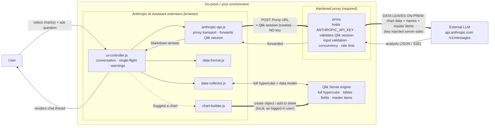
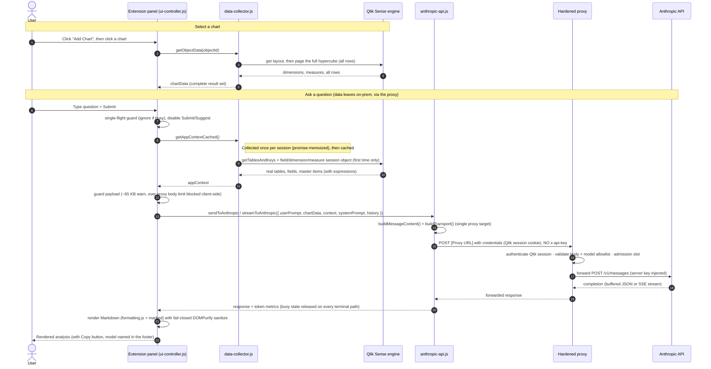
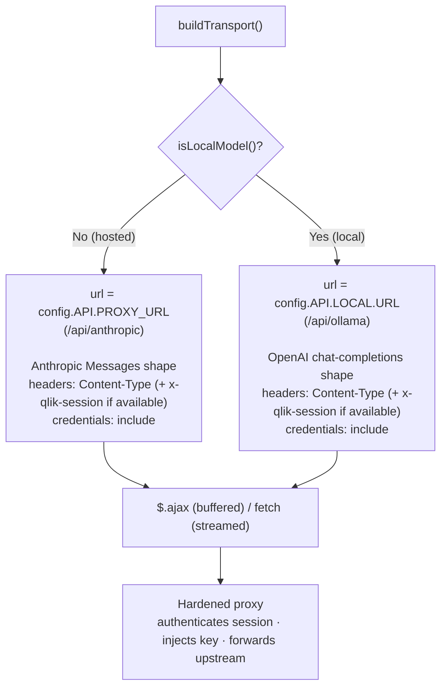
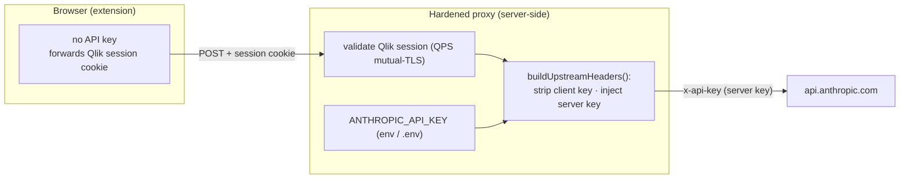

# Data Flow & Diagrams

How a question travels **User → Qlik Sense → proxy → external LLM → back**, and how a suggested chart
is created, for the Anthropic AI Assistant extension (v0.5.0). Diagrams use
[Mermaid](https://mermaid.js.org/) and render automatically on GitHub.

> ⚠️ **Independent project, no warranty or liability.** Not a Qlik product or supported integration.
> **Neither Qlik nor the author accept any liability** for use in any environment.
>
> **Data egress:** asking a question sends the **full** selected chart/table (complete hypercube), the
> app's **table and field names**, and **master dimension/measure definitions** out of the on-prem
> Qlik Sense environment **through the proxy** to an external LLM (`api.anthropic.com` by default). As
> of v0.5.0 the extension is **proxy-only**; the browser holds no API key. The **chart-creation** step
> (§5) writes back to the live Qlik app locally as the logged-in user and does **not** involve the LLM.

---

## 1. High-level data flow

The extension runs **in the browser** (the Qlik Sense client) and talks to the Qlik engine for chart
data. For analysis, Qlik data **leaves the on-prem environment** through the **proxy**, which holds the
API key and authenticates the caller, and crosses the trust boundary to an **external LLM**. The
chart-*creation* step (§5) stays local: it writes back to the Qlik app.



---

## 2. Request lifecycle (sequence)



---

## 3. Transport (proxy-only)

`anthropic-api.js -> buildTransport()` resolves the **single** proxy target per request; there is no
direct-browser mode. Hosted and local models differ only by route and body shape, never by credential;
both forward the Qlik session (`credentials: 'include'`) and carry **no** API key.



> A missing/blank proxy URL throws a clear error before any request is built. The proxy is mandatory;
> Qlik Cloud is out of scope.

---

## 4. Where the API key lives (v0.5.0)

The browser holds **no** key. The key lives only on the proxy, injected per request; any
client-supplied key header is stripped. The caller is identified by their Qlik session, not by a key.



> The key never reaches the browser. See [`docs/security-model.md`](./docs/security-model.md) for the
> full trust-boundary / threat model.

---

## 5. Chart creation (local write-back, no LLM)

"Suggest a chart" asks the model for a chart **spec** (the only LLM step). Building and placing the
chart happens **entirely in the browser** against the in-session Qlik engine, as the logged-in user,
no data is sent externally in this step. Writing to a sheet requires **Edit mode**.

```mermaid
flowchart TD
  R["LLM response<br/>(fenced qlik-chart JSON)"] --> P["chart-builder.parseChartSpec()<br/>3-pass lenient parse + structural validation"]
  P -->|"valid spec"| V["app.visualization.create(type, columns)<br/>live preview in the panel"]
  P -.->|"no valid spec"| T["fall back to Markdown text"]
  V --> ADD{"Add to sheet?<br/>(Edit mode required)"}
  ADD -->|"room on sheet"| PLACE["createChild + setProperties<br/>place below existing objects · doSave"]
  ADD -->|"sheet is full"| NEW["create a new sheet with the chart · gotoSheet"]
  ADD -->|"not in Edit mode"| HINT["show 'open in Edit mode' hint"]
  PLACE --> QS["Qlik app (persisted)"]
  NEW --> QS
```



---

## Module reference

| Module | Role in the flow |
|---|---|
| `main.js` | Entry; applies Model / Proxy-URL / Local-URL / Log-level properties to `config`; one-time init (paint guard); teardown on `destroy` |
| `config-validate.js` | Boot config validation (valid proxy URL, well-formed model registry, numeric bounds, log level) |
| `ui-controller.js` | Panel UI, conversation thread + memory, chart selection, single-flight request lifecycle, copy, payload warnings, assembles the request |
| `data-collector.js` | Extracts the selected chart's **full hypercube**; collects the **real data model** and caches it (promise-memoized `getAppContextCached`); teardown |
| `data-format.js` | Formats/trims chart data for the LLM |
| `anthropic-api.js` | Builds the message + serializes the data-model context, resolves the **single proxy transport** (`buildTransport`), forwards the Qlik session, POSTs to the proxy (buffered `$.ajax` or streamed `fetch`) |
| `chart-builder.js` | Parses the chart spec, renders a live preview, and adds the chart to the sheet (Qlik viz/engine API; Edit-mode write-back) |
| `formatting.js` | Markdown→HTML rendering (bundled `marked`) with **fail-closed DOMPurify** sanitize, and status messages |
| `log.js` | Level-gated console logging (ERROR/WARN/INFO/DEBUG), verbosity from `config.LOG_LEVEL` |
| `config.js` | Model registry, proxy/local endpoints, system prompt, data-collection bounds, `VERSION`/`BUILD`, `LOG_LEVEL` |
| `template.js` | Inlined panel markup |
```
