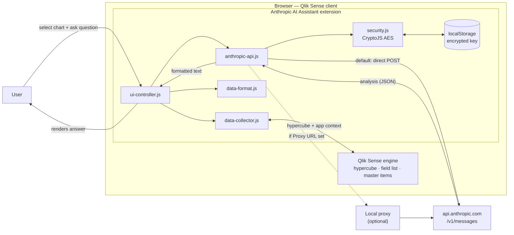
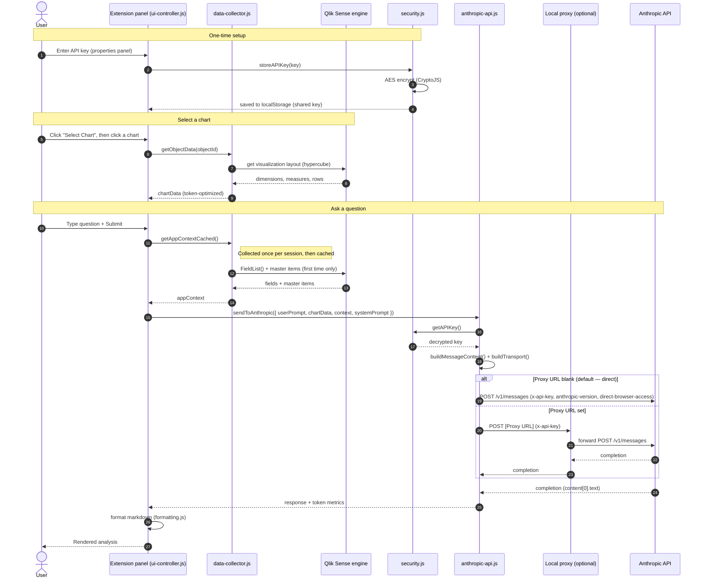
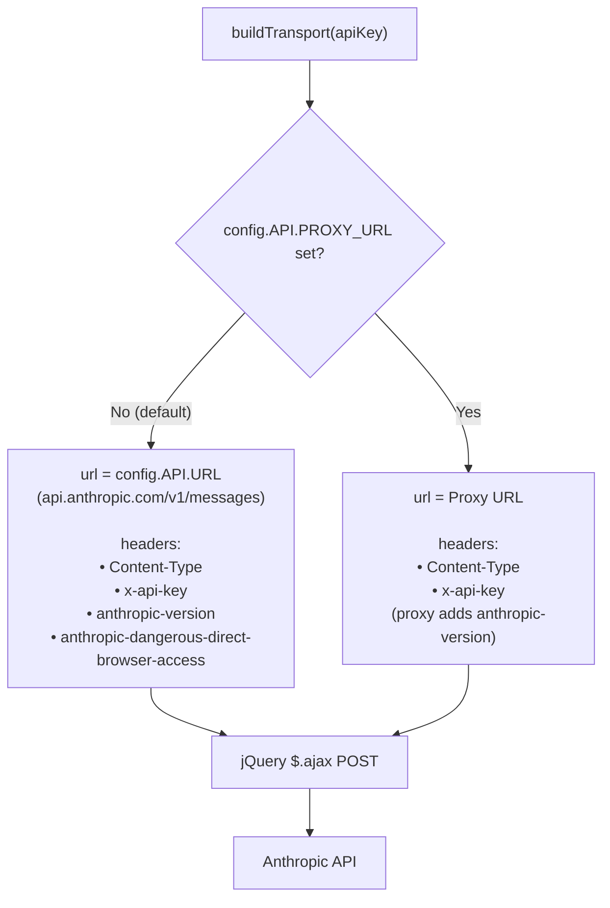
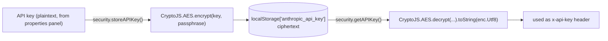

# Data Flow & Diagrams

How a question travels **User → Qlik Sense → Anthropic → back**, for the Anthropic AI Assistant
extension (v0.2.0). Diagrams use [Mermaid](https://mermaid.js.org/) and render automatically on
GitHub.

> ⚠️ Experimental / demo. In the default (direct) mode the API key is sent from the browser to
> `api.anthropic.com` and is only obfuscated in `localStorage`.

---

## 1. High-level data flow

Everything except the Anthropic API runs **in the browser** (the Qlik Sense client). The extension
talks to the Qlik engine for chart data and to Anthropic for the analysis.

---

## 2. Request lifecycle (sequence)

---

## 3. Transport decision (direct vs proxy)

`anthropic-api.js → buildTransport()` chooses the endpoint and headers per request based on
`config.API.PROXY_URL` (set from the **Proxy URL** property in `main.js:paint()`).

> **Enterprise note:** the direct path needs a one-time QMC **Content Security Policy** entry
> allowing `api.anthropic.com` on `connect-src`. The proxy path does not, but the proxy must be
> reachable from the browser.

---

## 4. API key storage

The key is entered once and reused across all Qlik apps. It is encrypted before storage and
decrypted only when building a request.

> The AES passphrase is bundled in the extension, so this is **obfuscation, not strong secrecy** —
> appropriate for on-prem internal demos only.

---

## Module reference

| Module | Role in the flow |
|---|---|
| `main.js` | Entry; applies Model/Proxy-URL properties to `config`; one-time init (paint guard) |
| `ui-controller.js` | Panel UI, chart selection, submit, assembles the request, renders the reply |
| `data-collector.js` | Extracts the selected chart's hypercube; caches the app context (`getAppContextCached`) |
| `data-format.js` | Formats/trims chart data for the LLM (token budget) |
| `anthropic-api.js` | Builds the message, selects transport (`buildTransport`), POSTs to Anthropic/proxy |
| `security.js` | Encrypts/decrypts the API key (CryptoJS AES, shared key) |
| `config.js` | Model, endpoint, version, proxy URL, system prompt, optimization defaults |
| `template.js` | Inlined panel markup |
| `formatting.js` | Markdown/HTML formatting of the response and status messages |
