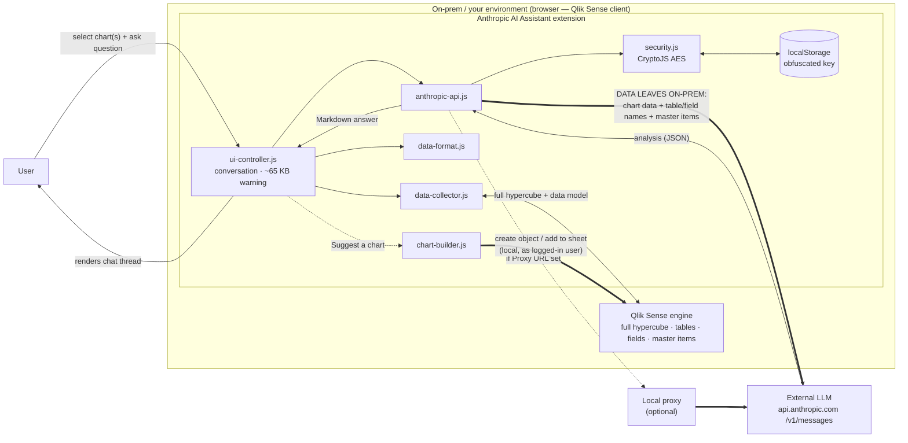
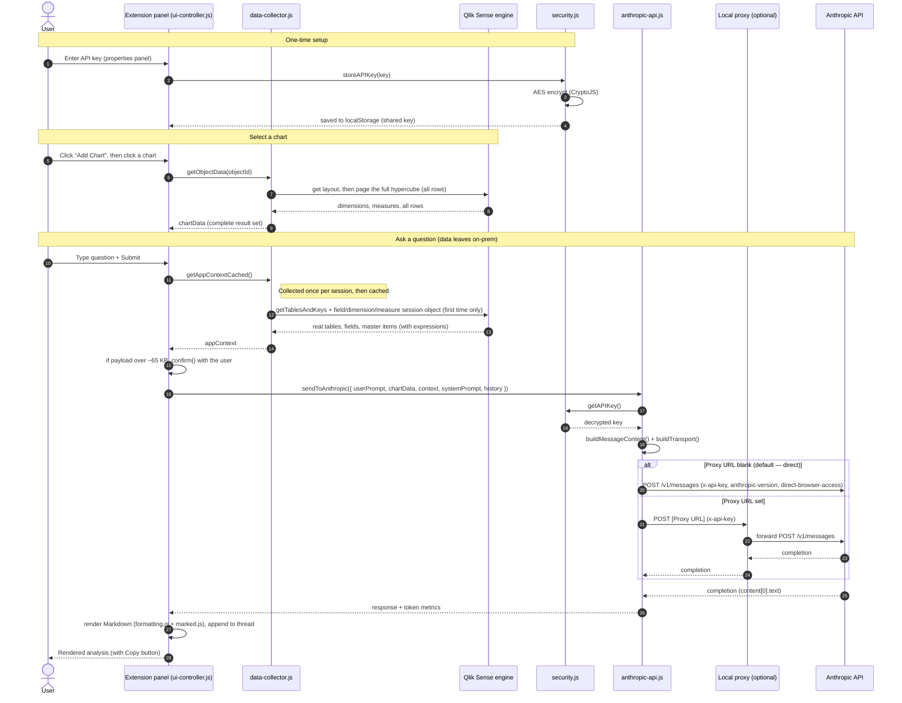
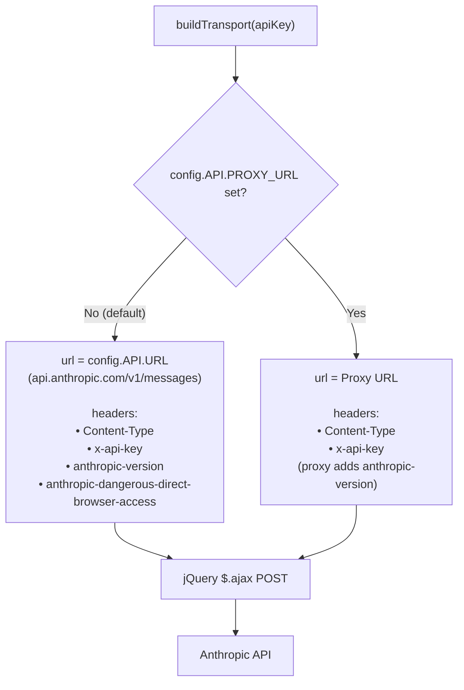
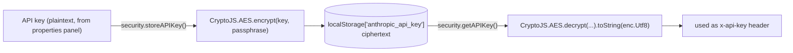
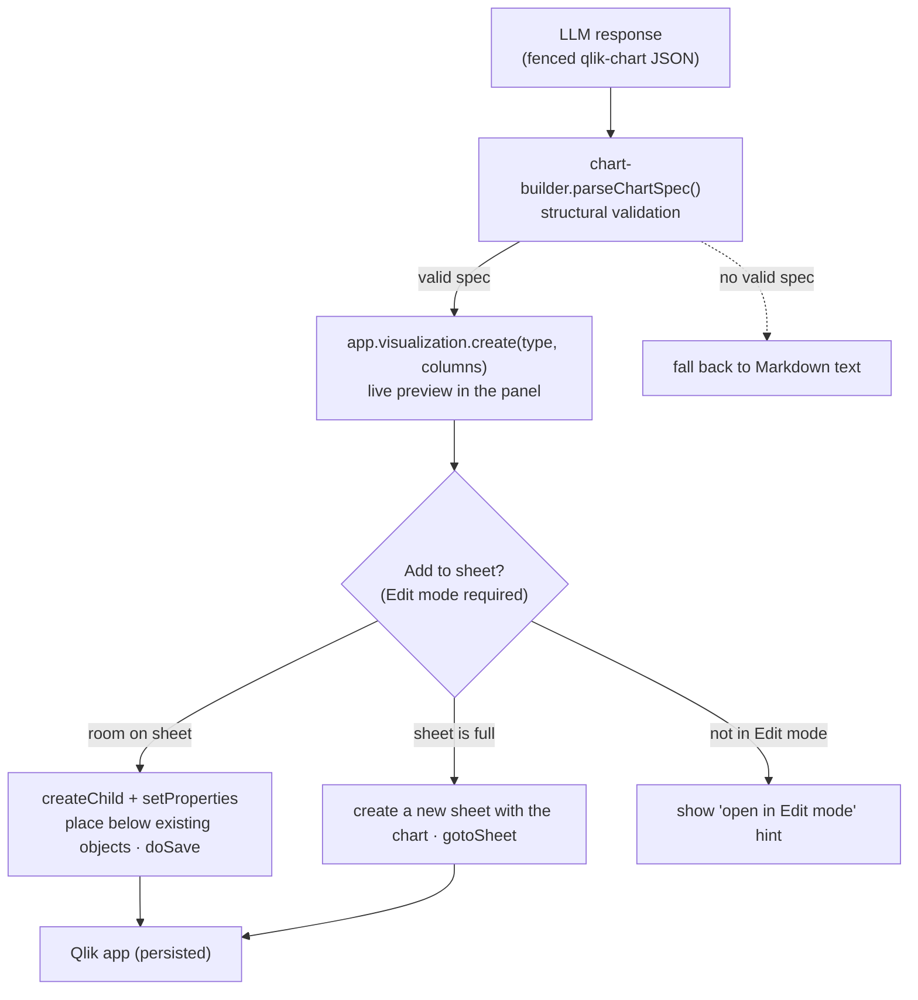

# Data Flow & Diagrams

How a question travels **User → Qlik Sense → external LLM → back**, and how a suggested chart is
created, for the Anthropic AI Assistant extension (v0.3.3). Diagrams use
[Mermaid](https://mermaid.js.org/) and render automatically on GitHub.

> ⚠️ **Demo only — no warranty, no liability.** Not a Qlik product or supported integration. **Neither
> Qlik nor the author accept any liability** for use in any environment.
>
> **Data egress:** asking a question sends the **full** selected chart/table (complete hypercube), the
> app's **table and field names**, and **master dimension/measure definitions** out of the on-prem
> Qlik Sense environment to an external LLM. In the default (direct) mode this goes from the browser to
> `api.anthropic.com`; the API key is only obfuscated in `localStorage`. The **chart-creation** step
> (§5) writes back to the live Qlik app locally as the logged-in user and does **not** involve the LLM.

---

## 1. High-level data flow

The extension runs **in the browser** (the Qlik Sense client) and talks to the Qlik engine for chart
data. For analysis, Qlik data **leaves the on-prem environment** and crosses the trust boundary to an
**external LLM**. The chart-*creation* step (§5) stays local — it writes back to the Qlik app.

---

## 2. Request lifecycle (sequence)

---

## 3. Transport decision (direct vs proxy)

`anthropic-api.js → buildTransport()` chooses the endpoint and headers per request based on
`config.API.PROXY_URL` (set from the **Proxy URL** property in `main.js:paint()`).

> **QSEoW note:** on client-managed Qlik Sense on Windows the direct path normally works as-is. If the
> environment blocks the outbound browser call, set a **Proxy URL** and route through a local proxy
> (which must be reachable from the browser). Qlik Cloud is out of scope.

---

## 4. API key storage

The key is entered once and reused across all Qlik apps. It is encrypted before storage and
decrypted only when building a request.

> The AES passphrase is bundled in the extension, so this is **obfuscation, not strong secrecy** —
> appropriate for on-prem internal demos only.

---

## 5. Chart creation (local write-back — no LLM)

"Suggest a chart" asks the model for a chart **spec** (the only LLM step). Building and placing the
chart happens **entirely in the browser** against the in-session Qlik engine, as the logged-in user —
no data is sent externally in this step. Writing to a sheet requires **Edit mode**.

---

## Module reference

| Module | Role in the flow |
|---|---|
| `main.js` | Entry; applies Model/Proxy-URL properties to `config`; one-time init (paint guard) |
| `ui-controller.js` | Panel UI, conversation thread + memory, chart selection, copy, ~65 KB warning, assembles the request |
| `data-collector.js` | Extracts the selected chart's **full hypercube**; collects the **real data model** (`getTablesAndKeys` + session lists) and caches it (`getAppContextCached`) |
| `data-format.js` | Formats/trims chart data for the LLM |
| `anthropic-api.js` | Builds the message + serializes the data-model context, selects transport (`buildTransport`), POSTs to the LLM/proxy |
| `chart-builder.js` | Parses the chart spec, renders a live preview, and adds the chart to the sheet (Qlik viz/engine API; Edit-mode write-back) |
| `security.js` | Encrypts/decrypts the API key (CryptoJS AES, shared key) |
| `config.js` | Model, endpoint, version, proxy URL, system prompt, optimization defaults |
| `template.js` | Inlined panel markup |
| `formatting.js` | Markdown→HTML rendering of responses (bundled `marked.js`) and status messages |
